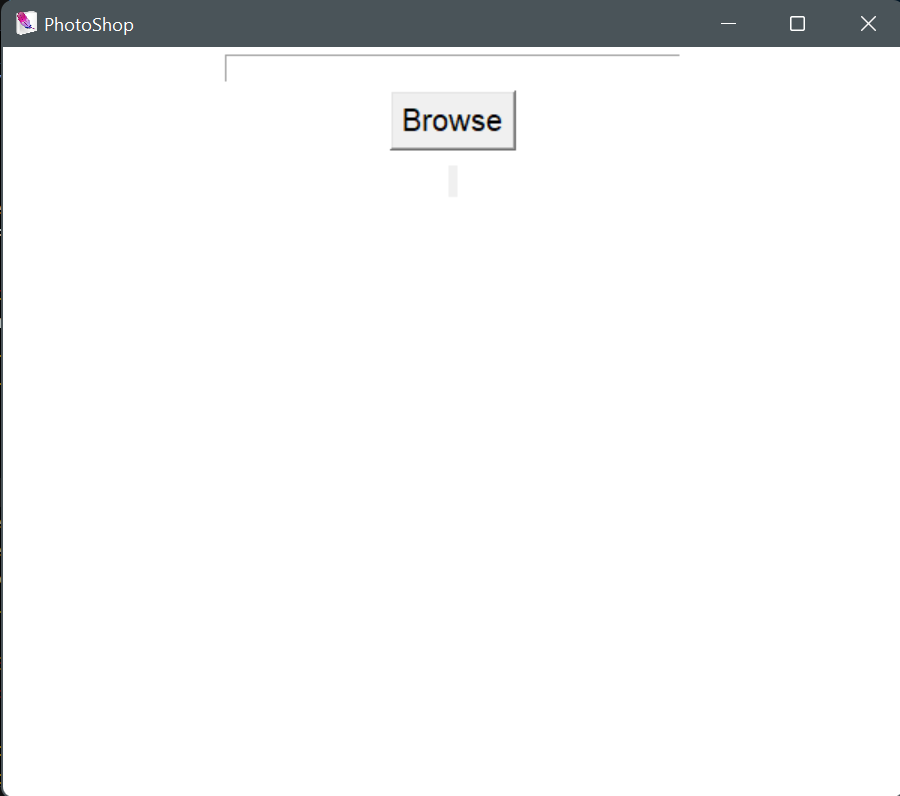
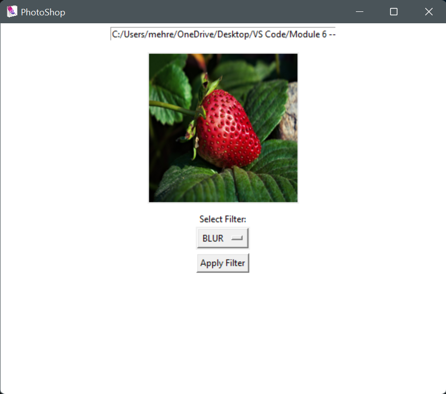
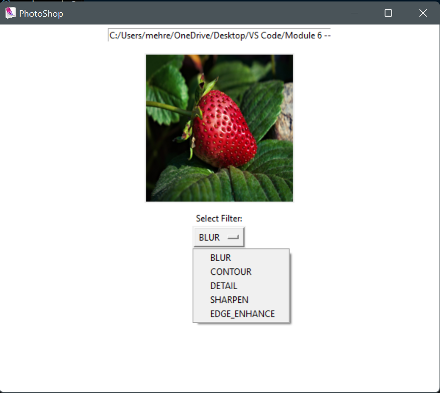

Photoshop prototype using Python, Pillow, and Tkinter

INTRO:
    This is a beginner-friendly image filtering GUI application made using Python's Tkinter and Pillow (PIL) libraries. You can browse an image, display it, and apply a range of visual filters through a dropdown menu.

FEATURES: 
- Select and display local `.jpg`, `.jpeg`, or `.png` images
- Resize image preview for better fit
- Apply real-time image filters using a dropdown
  - BLUR
  - CONTOUR
  - DETAIL
  - SHARPEN
  - EDGE_ENHANCE

SETUP INSTRUCTIONS:
- Need python (pillow library and tkinter)

EXPECTED OUTPUT should look like this:

